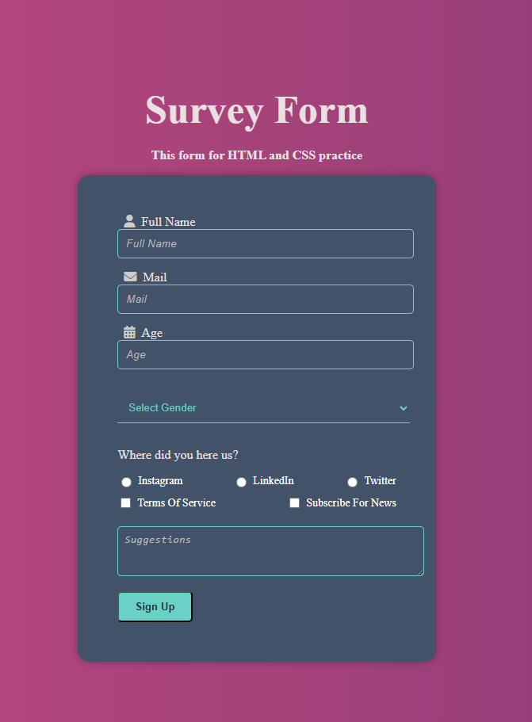

# 📝 Survey Form

Bu proje, HTML ve CSS kullanılarak oluşturulmuş basit ve şık bir anket formudur. Kullanıcıdan ad, e-posta, yaş, cinsiyet, sosyal medya tercihi ve çeşitli opsiyonel bilgiler alınır. Tamamen frontend odaklıdır ve eğitim/portfolyo amaçlı geliştirilmiştir.

## 📸 Ekran Görüntüsü

## 🔧 Kullanılan Teknolojiler

- HTML5
- CSS3
- Font Awesome (ikonlar için)

## 🧩 Özellikler

- Tam responsive tasarım
- Modern degrade arka plan
- Kullanıcı dostu input alanları
- Placeholder ve ikonlarla zenginleştirilmiş UI
- Checkbox ve radio butonlarıyla etkileşimli seçenekler

## 💡 Geliştirme Amaçları

Bu proje aşağıdaki amaçlarla oluşturulmuştur:

- Form tasarımı pratiği yapmak
- CSS ile stillendirme becerilerini geliştirmek
- Font Awesome entegrasyonunu öğrenmek
- Temiz, okunabilir ve kullanıcı dostu arayüz tasarımı yapmak

## 📌 Öğrenilenler

- HTML form elementleri
- CSS ile input, textarea ve select özelleştirme
- Flexbox ile hizalama
- `::placeholder` ve `::before` gibi pseudo elementler
- İkon yerleşimi ve etkileşim

