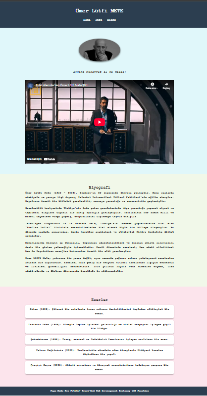

# Tribute Website - Ömer Lütfi Mete

Bu proje, CSS temelleri konusundaki ödev kapsamında hazırlanmıştır.  
Ödevin amacı, seçilen bir yazar veya edebi figür için bir tribute (saygı) websitesi tasarlamaktır.

## Kullanılan Teknolojiler

- **HTML5**
- **CSS3**

## Teknik Özellikler

- HTML5 ve CSS3 kullanılarak oluşturulmuştur.
- Responsive video düzeni sağlanmıştır.
- Her bölümün farklı arka plan renkleri ile tasarım zenginleştirilmiştir.
- Basit hover efektleri ve fade-in animasyonları ile kullanıcı deneyimi artırılmıştır.
- Kullanıcı dostu ve estetik bir görünüm hedeflenmiştir.

 **CSS Özellikleri:**
  - Flexbox ile temel hizalamalar sağlanmıştır.
  - Farklı section'lar için arka plan renkleri atanmıştır.
  - `hover` ve `transition` efektleri kullanılarak interaktif bir deneyim sağlanmıştır.
  - Basit bir `fadeInUp` animasyonu ile bölümlerin yumuşak görünmesi sağlanmıştır.
  
- **Responsive Tasarım:**
  - Video ve içerik, küçük ekranlarda da uyumlu görünmektedir (temel responsive uyum).

---
