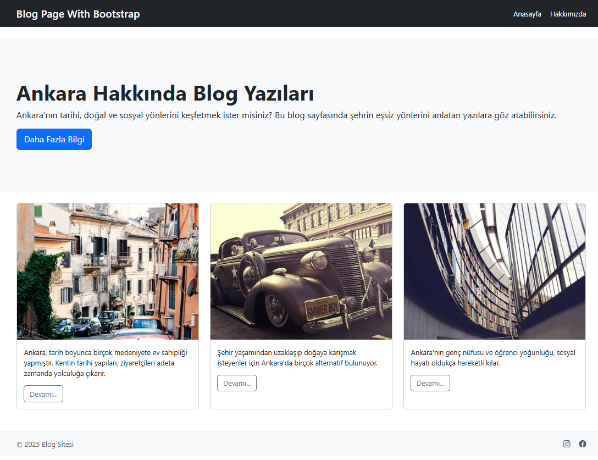

# Blog Web Sayfası - Bootstrap ile Tasarlandı

Bu proje, CSS ödevinde oluşturduğumuz blog web sayfasının Bootstrap 5 kullanılarak modern ve responsive bir hale getirilmiş versiyonudur. 

## 🚀 Proje Hakkında

Bootstrap’in sunduğu grid, card, jumbotron ve navbar bileşenleri kullanılarak siteye profesyonel bir görünüm kazandırılmıştır.

## 🛠️ Kullanılan Teknolojiler

- HTML5
- CSS3 (Bootstrap 5.3.6)
- Bootstrap Icons

## 📎 Kaynaklar

- [Bootstrap Resmi Sitesi](https://getbootstrap.com/)
- [Bootstrap Icons](https://icons.getbootstrap.com/)

---

> Bu proje bir ödev çalışmasıdır ve eğitim amaçlı hazırlanmıştır.

## 📸 Ekran Görüntüsü

Aşağıda blog sayfasının ekran görüntüsünü bulabilirsiniz:

