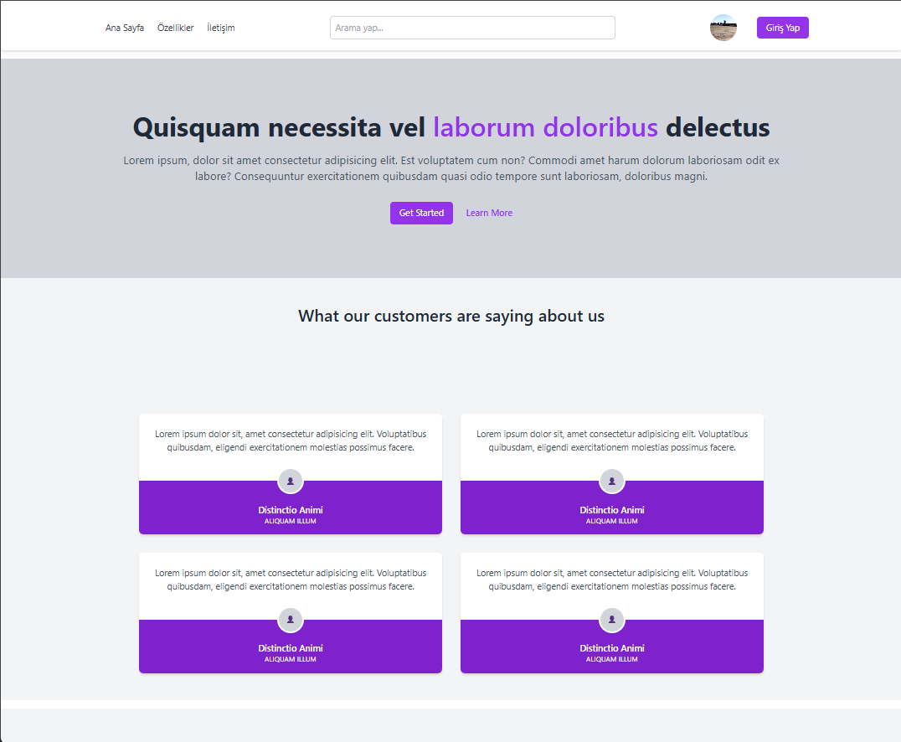
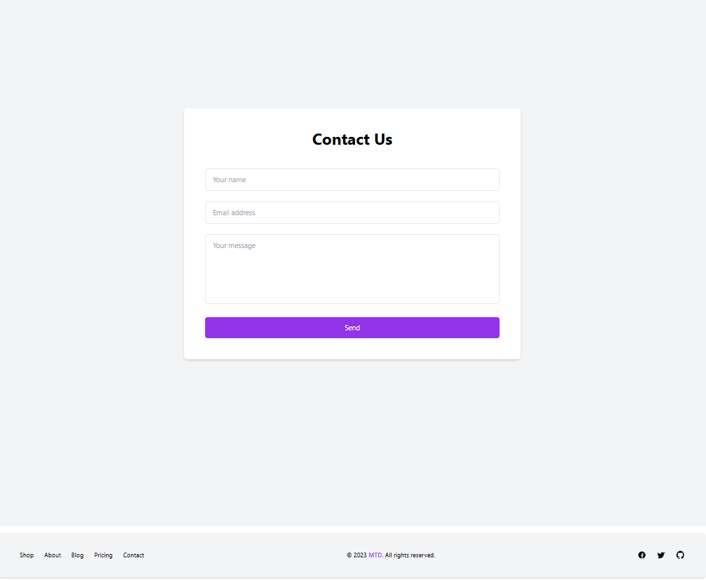

# Web Arayüz Tasarımı Ödevi

Bu proje, HTML ve Tailwind CSS kullanılarak hazırlanmış temel bir web arayüz tasarımı ödevidir. Proje farklı bölümler (header, hero, testimonial, form ve footer) barındırmaktadır.

## 📸 Sayfa Özeti

Sayfa aşağıdaki bölümlerden oluşmaktadır:

- **Header (Üst Menü):** Logo, menü bağlantıları, arama çubuğu ve "Giriş Yap" butonu içerir.
- **Hero Bölümü:** Başlık, açıklama ve çağrı (CTA) butonlarıyla ana tanıtım alanıdır.
- **Müşteri Yorumları (Testimonial):** Dört adet örnek müşteri yorumu kartı.
- **İletişim Formu:** Kullanıcıların ad, e-posta ve mesaj bilgilerini girmesini sağlayan bir form.
- **Footer (Alt Menü):** Sayfa linkleri ve sosyal medya ikonlarını içerir.

## 🚀 Kullanılan Teknolojiler

- **HTML5**
- **Tailwind CSS (CDN üzerinden)**

## 💡 Notlar

- İkonlar SVG olarak yerleştirilmiştir ve herhangi bir ikon kütüphanesi kullanılmamıştır.
- Sayfa tamamen responsive (mobil uyumlu) olacak şekilde tasarlanmıştır.

## Ekran Görüntüsü

