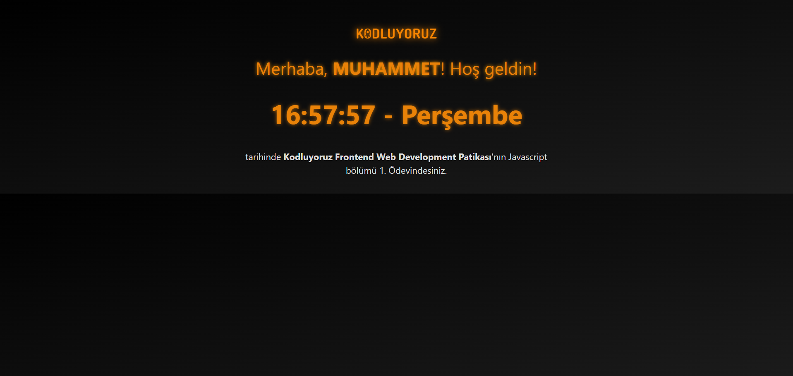

# Kodluyoruz Javascript Saat Ödevi

Bu proje, [Kodluyoruz](https://www.kodluyoruz.org) Frontend Web Development Patikası'nın Javascript bölümünde verilen 1. ödev kapsamında geliştirilmiştir. Kullanıcıdan alınan isimle kişisel bir karşılama yapılır ve ekranın ortasında anlık saat ve gün bilgisi görüntülenir.

## 🔧 Özellikler

- Kullanıcıdan ad bilgisi `prompt` ile alınır.
- Girilen ad geçerli değilse (boş, sadece boşluk vs.) tekrar istenir.
- Canlı saat (`saat:dakika:saniye`) saniye saniye güncellenir.
- CSS ile geliştirilmiş sade ve modern bir tasarım sunulmuştur.

## 🖼️ Ekran Görüntüsü

## 🛠️ Kullanılan Teknolojiler

- HTML5
- CSS3 (Bootstrap destekli)
- JavaScript (Vanilla)

