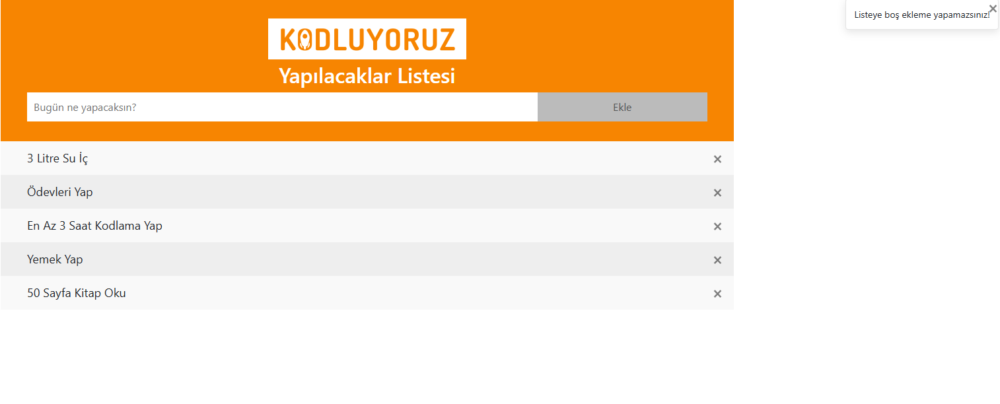
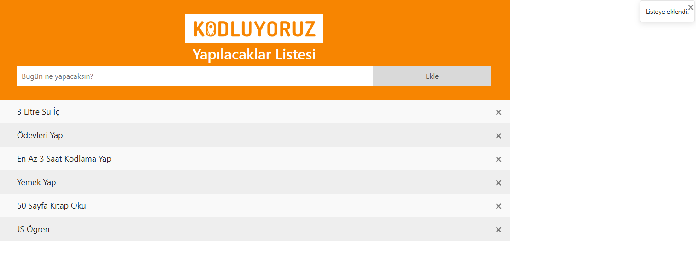
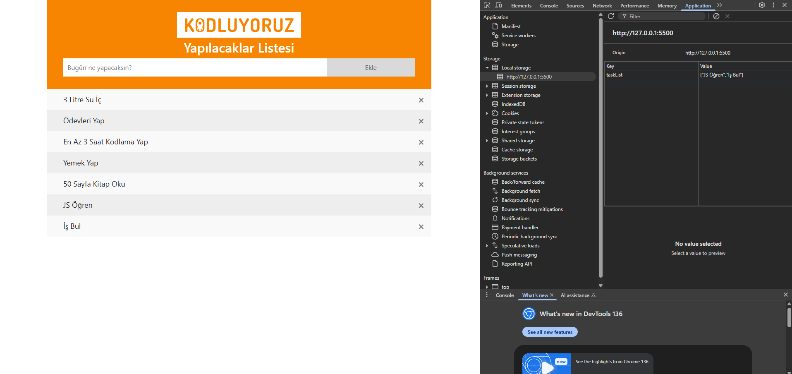
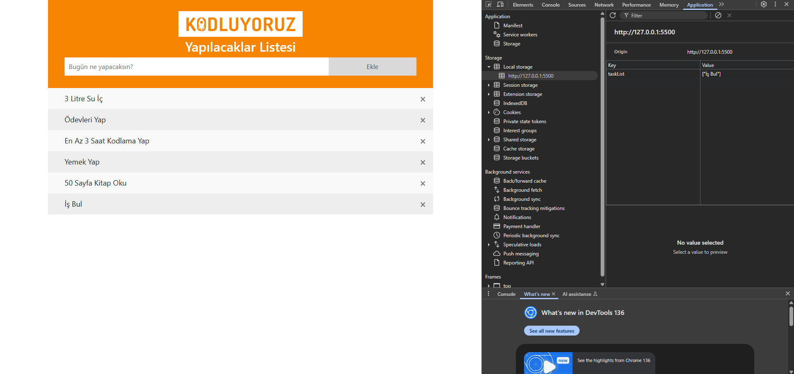

## 📝 To Do List App

Bu proje, kullanıcıların görevlerini ekleyip, silebileceği ve tamamlanmış olarak işaretleyebileceği basit bir JavaScript tabanlı yapılacaklar listesi uygulamasıdır. Görevler localStorage kullanılarak kalıcı hale getirilmiştir, böylece sayfa yeniden yüklendiğinde görevler kaybolmaz.

# 🚀 Özellikler

+ Görev Ekleme: Kullanıcılar yeni görevler ekleyebilir.

    ❌ Görev Silme: Kullanıcılar görevleri listeden silebilir.

    ✅ Görev Tamamlama: Bir göreve tıklayarak görevi tamamlanmış olarak işaretleyebilirsiniz (görünümde değişiklik yapar).

    💾 Veri Kalıcılığı: Görevler localStorage'a kaydedilir, sayfa yenilense bile görevler korunur.

    🎉 Başarı ve Hata Mesajları: Yeni görev eklerken başarı veya hata mesajları gösterilir.

# ⚙️ Kullanılan Teknolojiler

    HTML: Uygulamanın temel yapısını oluşturur.

    CSS: Uygulamanın stilini belirler (özelleştirilebilir).

    JavaScript: Temel işlevsellik ve DOM manipülasyonu.

    Bootstrap: Başarı ve hata mesajlarını (toast mesajları) göstermek için kullanılır.

# ✨ Nasıl Çalışır?

    1. ➕ Görev Ekleme
        Kullanıcı, görevini yazıp "Ekle" butonuna tıklar.

        Görev, sayfada görüntülenir.

        Eğer görev geçerli (boş değil) ise, localStorage'a kaydedilir.

    2. ✅ Görev Tamamlama
        Bir göreve tıklanarak, tamamlanmış olarak işaretlenebilir. Bu, görevin görünümünü değiştirir.

        Görev, "checked" sınıfı eklenip çıkarılarak tamamlanmış sayılır.

    3. ❌ Görev Silme
        Her görevde bir "kapat" butonu (×) vardır. Bu butona tıklandığında görev, hem sayfadan hem de localStorage'tan silinir.

## Ekran Görüntüleri
# Boş karakter eklenmeye çalışıldığında alınan uyarı mesajı

# Listeye yeni bir madde eklendiğinde alınan başarı mesajı ve liste son durumu

# Başarılı bir şekilde listeye eklenen maddeler localStorage'ye de eklenir

# Listeden silinen bir madde localStorage'den da kaldırılır.
