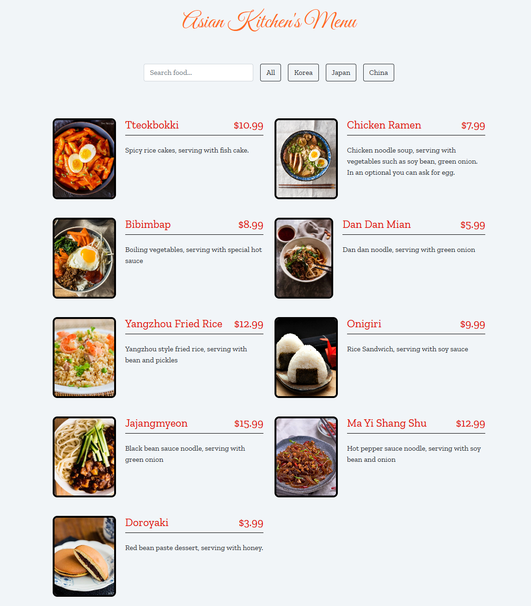
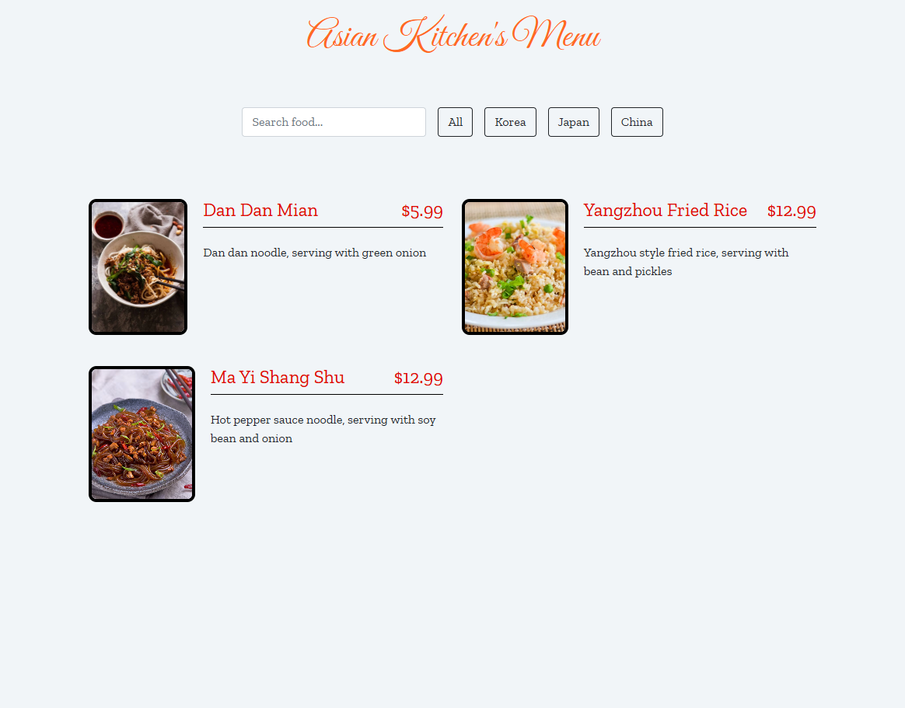
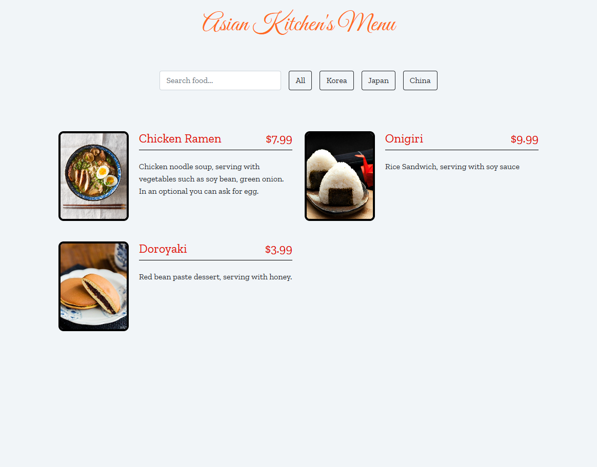
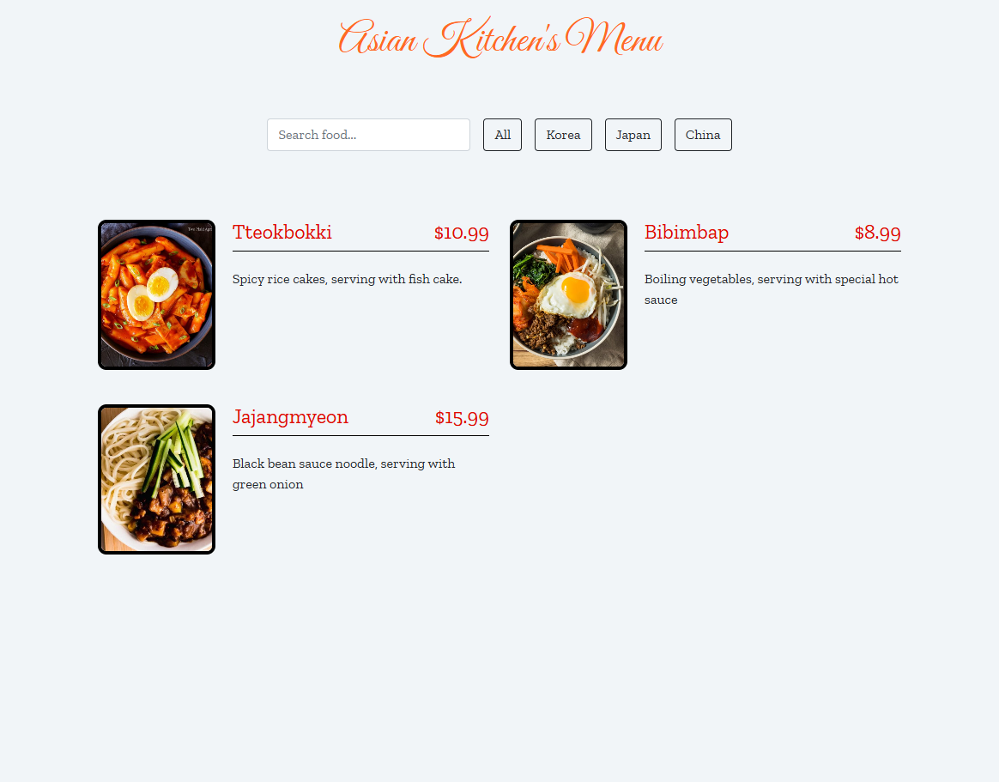
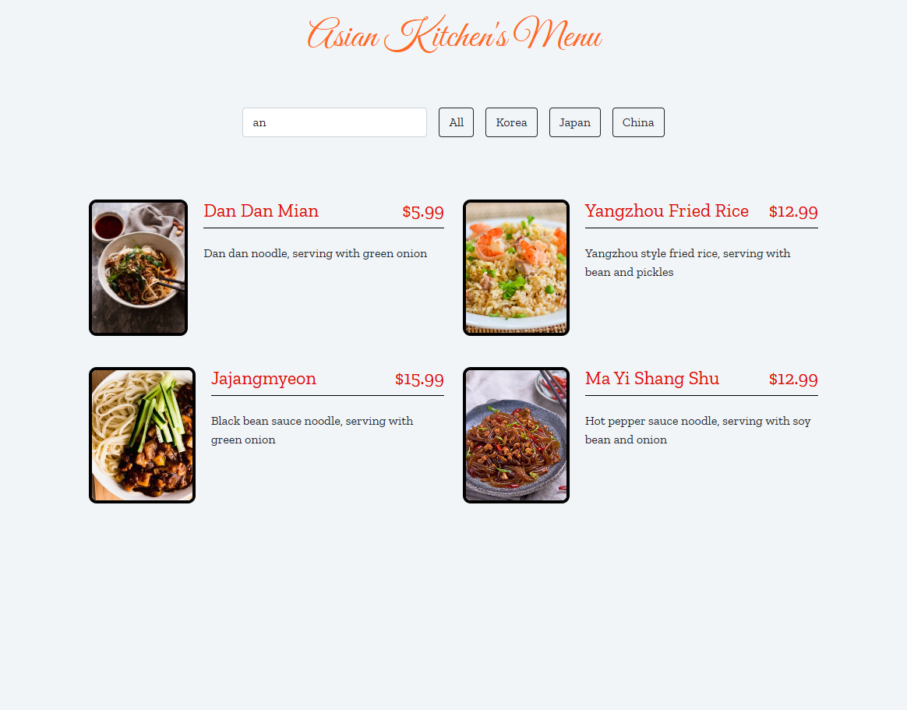

# 🍜 Asian Cuisine Menu App

Bu proje, farklı Asya ülkelerine ait yemekleri listeleyen ve filtreleme ile arama özellikleri sunan basit bir JavaScript uygulamasıdır. Kullanıcılar yemekleri ülkeye göre filtreleyebilir veya başlıklarına göre arama yapabilir.

## 🔧 Özellikler

- ✅ Dinamik yemek menüsü gösterimi
- ✅ Ülkeye göre filtreleme (Korea, Japan, China)
- ✅ Arama kutusuyla başlığa göre filtreleme
- ✅ Bootstrap ile responsive tasarım
- ✅ JavaScript ile tamamen dinamik DOM işlemleri

## 🖼️ Ekran Görüntüsü

## 📜 Kullanılan Teknolojiler

- HTML
- CSS
- Bootstrap
- JavaScript

## 👨‍💻 Geliştirici Notları

Menü verileri sabit (menu adlı array içinde).

Arama fonksiyonu sadece başlık (title) alanında çalışır, ancak açıklama (desc) üzerinde de genişletilebilir.