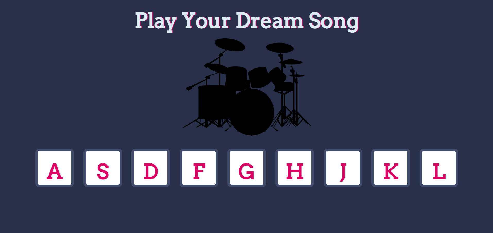

# 🥁 Drum Kit

Bu proje, tuşlara basarak veya butonlara tıklayarak farklı davul seslerini çalmanıza olanak tanıyan basit bir web uygulamasıdır.

## 🎯 Özellikler

- Klavyedeki `A` - `L` tuşları ile farklı davul seslerini çalabilirsiniz.
- Aynı işlevsellik butonlara tıklayarak da sağlanır.
- Her tuş veya buton için animasyon ve arka plan rengi değişimi içerir.
- Basit ve kullanıcı dostu arayüz.
- Tüm sesler önceden yüklenir ve hızlı çalma için optimize edilmiştir.

## 🧱 Kullanılan Teknolojiler

- HTML5
- CSS3
- JavaScript (Vanilla JS)
- Google Fonts (Arvo)

## 📷 Ekran Görüntüsü

## Siteyi Ziyaret Ederek Deneyimleyebilirsiniz

 https://muhammet-tarik-dumanli.github.io/PatikaPlus-Front-End/Drum-Kit/
