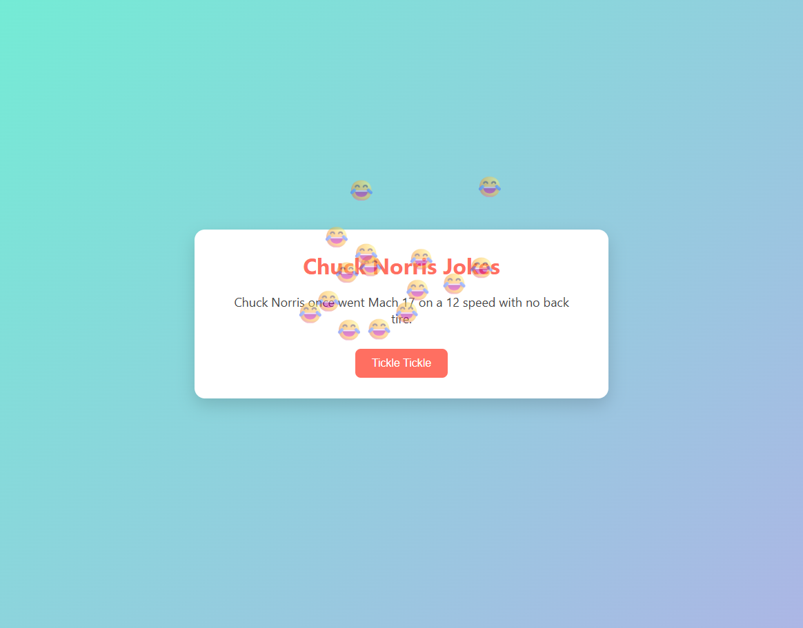

# Chuck Norris Tickle App 🎉😂

Bu proje, Chuck Norris'ten rastgele espriler getiren eğlenceli bir web uygulamasıdır.  
"Tickle Tickle" butonuna bastığınızda:

- Chuck Norris API üzerinden bir espri gelir,
- Kahkaha sesi çalar,
- Ve ekranda uçuşan kahkaha emojileri belirir.

Kullanıcıya hem görsel hem işitsel eğlence sunar.

## 🔧 Özellikler

- 🌐 [Chuck Norris Jokes API](https://api.chucknorris.io) ile rastgele espri çekme
- 🔊 Kahkaha sesi efekti (`Laugh-Effect.mp3`)
- 😂 Uçuşan animasyonlu kahkaha emojileri
- 🎨 CSS ile şık ve sade tasarım
- 💡 JavaScript kullanılarak DOM üzerinde tam kontrol

## 📚 Kullanılan Teknolojiler

- HTML5
- CSS3 (Animasyonlar dahil)
- JavaScript (Vanilla)
- Fetch API
- Chuck Norris Jokes API

## 🖼️ Ekran Görüntüsü

Bu proje, JavaScript ile DOM işlemleri, API kullanımı ve basit animasyonları öğrenmek için güzel bir örnektir.

🎉 İyi eğlenceler!
